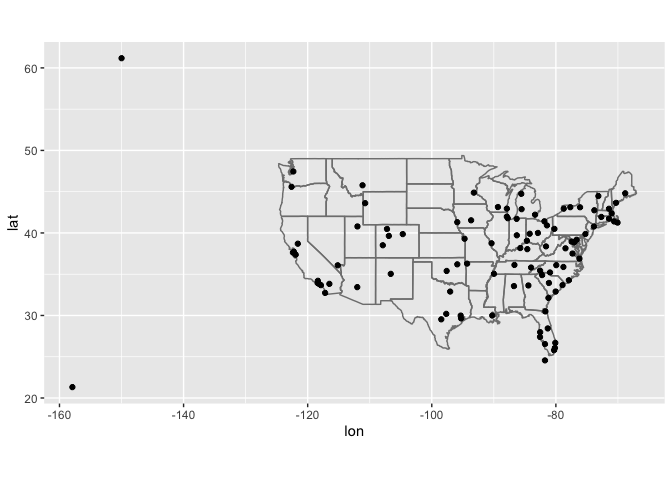
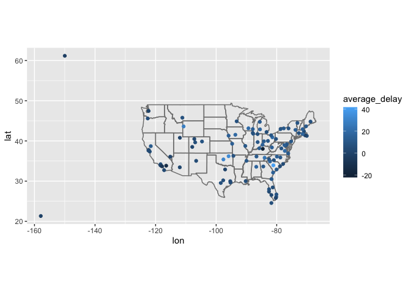
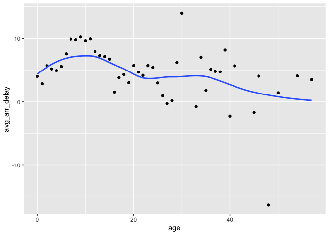
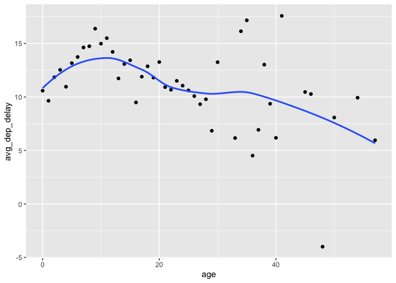

Stat 433 HW 3
================
2022-10-19

URL of Github:

HW 3

``` r
library(dplyr)
```

    ## 
    ## Attaching package: 'dplyr'

    ## The following objects are masked from 'package:stats':
    ## 
    ##     filter, lag

    ## The following objects are masked from 'package:base':
    ## 
    ##     intersect, setdiff, setequal, union

``` r
library(nycflights13)
library(ggplot2)
library(tidyr)
```

1.  Compute the average delay by destination, then join on the airports
    data frame so you can show the spatial distribution of delays.
    Here’s an easy way to draw a map of the United States:

``` r
airports %>%
  semi_join(flights, c("faa" = "dest")) %>%
  ggplot(aes(lon, lat)) +
    borders("state") +
    geom_point() +
    coord_quickmap()
```

<!-- -->

(Don’t worry if you don’t understand what semi_join() does — you’ll
learn about it next.)

You might want to use the size or colour of the points to display the
average delay for each airport.

``` r
flights %>% 
  group_by(dest) %>%
  summarize(average_delay = mean(arr_delay, na.rm = TRUE)) %>%
  left_join(airports, by = c('dest' = 'faa')) %>%
  ggplot(aes(lon, lat, color = average_delay)) +
  borders('state') +
  geom_point() +
  coord_quickmap()
```

    ## Warning: Removed 4 rows containing missing values (geom_point).

<!-- -->

2.  Add the location of the origin and destination (i.e. the lat and
    lon) to flights.

``` r
flights %>% 
  left_join(airports, by = c('dest' = 'faa')) %>%
  left_join(airports, by = c('origin' = 'faa'), 
            suffix = c('_dest', '_origin')) %>%
  select(dest, origin, lat_dest, lat_origin, lon_dest, lon_origin)
```

    ## # A tibble: 336,776 × 6
    ##    dest  origin lat_dest lat_origin lon_dest lon_origin
    ##    <chr> <chr>     <dbl>      <dbl>    <dbl>      <dbl>
    ##  1 IAH   EWR        30.0       40.7    -95.3      -74.2
    ##  2 IAH   LGA        30.0       40.8    -95.3      -73.9
    ##  3 MIA   JFK        25.8       40.6    -80.3      -73.8
    ##  4 BQN   JFK        NA         40.6     NA        -73.8
    ##  5 ATL   LGA        33.6       40.8    -84.4      -73.9
    ##  6 ORD   EWR        42.0       40.7    -87.9      -74.2
    ##  7 FLL   EWR        26.1       40.7    -80.2      -74.2
    ##  8 IAD   LGA        38.9       40.8    -77.5      -73.9
    ##  9 MCO   JFK        28.4       40.6    -81.3      -73.8
    ## 10 ORD   LGA        42.0       40.8    -87.9      -73.9
    ## # … with 336,766 more rows

3.  Is there a relationship between the age of a plane and its delays?

``` r
plane_age_info <- left_join(flights, select(planes, tailnum, plane_year = year),
  by = "tailnum") %>%
  mutate(age = year - plane_year) %>%
  filter(!is.na(age)) %>%
  group_by(age) %>%
  summarise(
    avg_arr_delay = mean(arr_delay, na.rm = TRUE),
    avg_dep_delay = mean(dep_delay, na.rm = TRUE),
  )
ggplot(plane_age_info, aes(x = age, y = avg_arr_delay)) +
  geom_point() +
  geom_smooth(se = FALSE)
```

    ## `geom_smooth()` using method = 'loess' and formula 'y ~ x'

<!-- -->

``` r
ggplot(plane_age_info, aes(x = age, y = avg_dep_delay)) +
  geom_point() +
  geom_smooth(se = FALSE)
```

    ## `geom_smooth()` using method = 'loess' and formula 'y ~ x'

<!-- -->

According to the graphs, there is a weak negative relationship between
the year of a plane and arrival delay; also, there is a weak negative
relationship between the year of a plane and departure delay. But they
are so weak that we can ignore the relationships.
